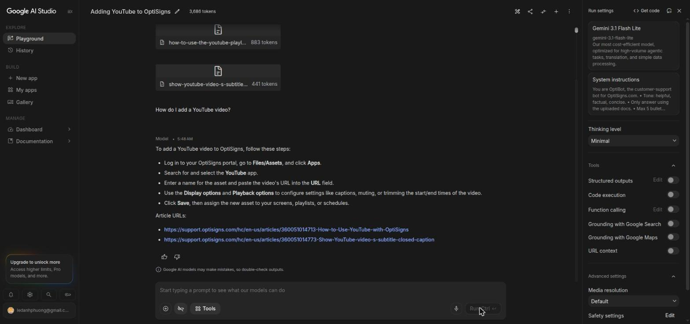
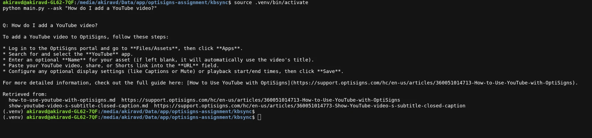

# kbsync

Daily one-way sync from a Zendesk Help Center into a Gemini File Search store, so an
assistant answers support questions from the current docs and cites them. Each run uploads
only what changed.

## Setup

```bash
python -m venv .venv && source .venv/bin/activate
pip install -r requirements-dev.txt
cp .env.sample .env                    # ZENDESK_HOST, GEMINI_API_KEY
python main.py --create-store kbsync   # once; paste the name into .env
```

## Run locally

```bash
python main.py                      # full sync; --limit N for a quick pass
python main.py --no-upload          # Markdown only, no API key needed
python main.py --ask "How do I add a YouTube video?"
pytest -q                           # 63 offline tests, no key needed
pytest -m eval                      # 6-case eval set, against the live store
```

With Docker, which is what the scheduled job runs:

```bash
docker build -t kbsync .
docker run --rm --env-file .env kbsync      # or: ... kbsync main.py
```

Runs once and exits 0; exits 1 with one line if required settings are missing.

## Chunking strategy

**512 tokens per chunk, 128 overlap**, set per file through `chunkingConfig` rather than left
to the service default. 512 is the service maximum, so the real decision was the overlap:
articles are short procedures with headed sections, and 512 tokens usually holds one section
whole. The 128-token overlap (25%) carries the end of one section into the next so a numbered
sequence split across a boundary stays answerable, without storing a quarter of the corpus
twice as a 50% overlap would. Both are configurable; a value over 512 is rejected locally
rather than by the API.

Every file repeats its `Article URL:` outside the YAML front matter. That is load-bearing: a
File Search citation hands back the matched **chunk text**, not a link, so the URL has to be
in the body for an answer to cite it. Each run logs files written and chunks embedded.

Both suites as they actually ran — 63 offline in 0.3s, 6 live in 61s, all passing — are
captured in [`docs/test-results/`](docs/test-results/). The eval set comes from real
conversations with the production bot; one case asks about a player that does not exist and
asserts no article URL is invented, checking anything cited against the manifest.

## Daily job

`fly.toml` plus `deploy-fly.sh` create a Fly Machine with `--schedule daily`: it wakes, runs
`main.py` once, and stops. Deploy once with `./deploy-fly.sh` after
`fly secrets set ZENDESK_HOST=... GEMINI_API_KEY=... GEMINI_FILE_SEARCH_STORE=...`.

**Logs:** https://fly.io/apps/kbsync/monitoring, or `fly logs -a kbsync`. That page needs a Fly
account, so the last-run artefact is committed as [`docs/run-log.md`](docs/run-log.md) — the
transcript of a real scheduled run, readable by anyone. Every run logs `added / updated /
skipped`.

Delta detection compares a sha256 of each converted body against the hash stored on the
document in the store, so an unchanged Help Center costs no uploads: a second pass over 416
articles takes about a second.

## Screenshot



**The articles are attached to that prompt because File Search has no UI.** Studio offers
Search grounding, code execution, function calling, Maps and URL context, and nothing that
points at a store; its Agents take inline files, GCS buckets or repositories, which mount
bytes into a sandbox rather than query an index. Attaching the articles is the only way to
put documents in front of the model there, so the capture proves the prompt and the Markdown
— not retrieval.

Retrieval is proved from the command line, where the store really is queried:



and the difference is measured, not asserted. [`docs/retrieval-check.md`](docs/retrieval-check.md)
asks one question both ways: grounded, four of four values exact and the citation resolves;
ungrounded, the same model invents the settings and cites a 404.

## Notes

- **Gemini rather than OpenAI** — both are allowed. File Search storage and query-time
  embeddings are free, so a daily job costs nothing.
- **Uploads are plain REST calls**, never the dashboard: resumable start, finalise, wait for
  the import, drop the document it replaced.
- **State lives in the store**, not on disk — nothing to mount, nothing lost when the
  container exits. `articles/` is regenerated every run and is not committed.
- **`GEMINI_MODEL` defaults to `gemini-flash-lite-latest`.** The free tier caps requests per
  model per day and `gemini-flash-latest` allows 20. Quota replies carry a `Retry-After`
  measured in hours, so the HTTP layer refuses any wait over a minute rather than sleeping
  until tomorrow.
- **Citation style varies run to run.** The prompt asks for `Article URL:` lines and usually
  gets them, but the model sometimes renders the citation as a markdown link instead — which
  is how the production OptiBot cites. The prompt is used verbatim regardless; this is an
  observation, not a correction.
- **Indexing is the slow part**, not answering: ~10s per document, so a first index of 416
  articles takes about 70 minutes. Every run after that is a second.
